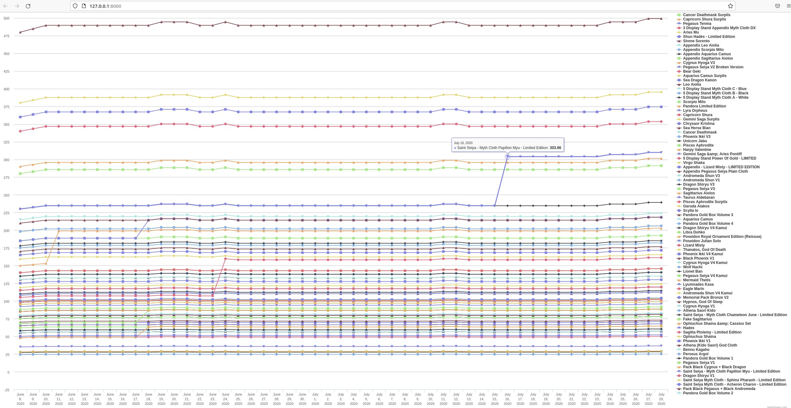

# Online Store Scraper


Spider to retrive prices from [redacted to avoid issues]. Originally used for Saint Seiya Myth Cloth action figures but it works with any product on the website. It also includes a Django aplication to save the results in a model and display them on a template using a js graph.




## Disclaimers

This is not by any means an endorsement to the website. In a matter of fact, this is a legacy project and not longer under development because of the many issues and complaints the company received for the last months. Please use a different store for either shopping or implementing a similar project.

This is a very old project. Please don't judge lol

## Requirements

- python2
- virtualenv (recommended)

## Setup

```bash
# install and activate virtual environment
virtualenv venv --python=python2
source venv/bin/activate

# install dependencies
pip install -r requirements.txt
```
## Usage

In the Django admin, create all the Items setting the name and the url of each product you want to retrieve. For example: `https://www.nippon-yasan.com/figures/110-myth-cloth-wyvern-radamanthys.html`

```bash
# run the spider
scrapy crawl nippon_yassan_com_scrapper_prices

# run dev server
./manage.py runserver

# in case you forgot to scrape one day, you can fill using the values of the same day
# Examples:
./manage.py fill 1  # fill yesterday
./manage.py fill 2  # fill the day before yesterday
```

The scraped data will be stored in a `db.sqlite3` DB.
